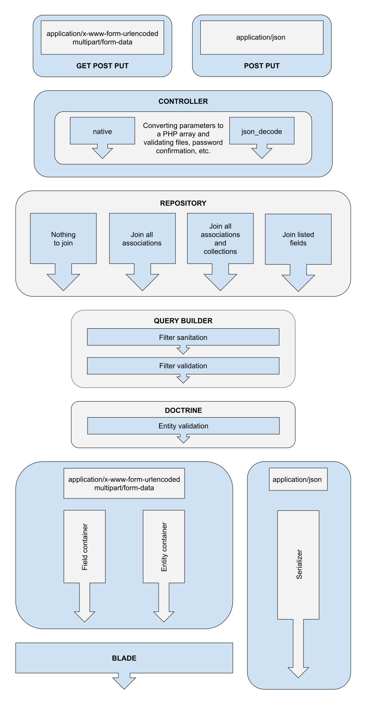

# Extensions for Doctrine Integration



## I. Json-like query building parameters

Without any additional funds allows you to convert:

1. From request parameters -- native **PHP**
2. To request parameters -- http\_build\_query (built-in function) **PHP**
3. From json -- json_decode (built-in function) **PHP**
4. To json -- json_encode (built-in function) **PHP**
5. From request parameters -- jQuery.deparam **JS** (unfortunately plugin) 
6. To request parameters -- jQuery.param **JS**

HTTP request can be made by any method (GET, POST, PUT и т. д.).

An example of creating a database query: 

```PHP
[
    'select' => [
        'user',
        'user.createdBy',
        'user.updatedBy',
        'user.deletedBy'
    ],
    'filter' => [
        [
            "or",
            ["user.updatedBy.name", "like", "administrator"],
            ["user.updatedBy.name", "notLike", "nimda"],
            [
                ["user.id", "isNotNull"],
                ["user.id", "between", 1, 2]
            ]
        ],
        ["user.id", "in", [ 1, 2, 3 ]]
    ],
    'order' => ['user.name', '-user.createdBy.id']
];
```
Its counterpart on Doctrine (filtering only):  

```PHP
$qb->where(
    $qb->expr()->andX()->addMultiple([
        $qb->expr()->orX()->addMultiple([
            $qb->expr()->like('user_updatedBy.name', ':name1'),
            $qb->expr()->notLike('user_updatedBy.name', ':name2'),
            $qb->expr()->andX()->addMultiple([
                $qb->expr()->notNull('user.id'),
                $qb->expr()->between('user.id', ':id3', ':id4)
            ])
        ]),
        $qb->expr()->in('user.id', ':id5')
    ])
);
```

DQL result (filtering only):

```SQL
LEFT JOIN user.createdBy user_createdBy
LEFT JOIN user.updatedBy user_updatedBy
LEFT JOIN user.deletedBy user_deletedBy
WHERE (
	user_updatedBy.name LIKE :name1
	OR user_updatedBy.name NOT LIKE :name2
	OR (
		user_updatedBy.id IS NOT NULL AND (user_updatedBy.id BETWEEN :id3 AND :id4)
	)
) AND user.id IN(:id5)
```

Automatic generation of LEFT JOIN if necessary, based on parts of select, filter, order. Ability to use aliases, DQL expressions (only on the server side). Available operators: eq neq gt gte lt lte isNull isNotNull like notLike in notIn between  
The grouping and everything connected with it were not realized intentionally Based on the fact that all statistical queries will be encoded by the developer independently.

## II. This universality of the exchange of parameters and the presence of Doctrine mapping made it possible to remove from the controller the validation of relationships between entities, the presence of fields on entities, operators, parameter structures and the clearing of user-entered values ​​with strict typing inside this package.

To facilitate debugging, a Development Exception is used with a detailed description of the developer error.  
Validation of user-entered values ​​for editing requests is performed centrally within the model. This makes it possible to guarantee data integrity no matter how they are delivered, whether it be Seeder, Cron, Web, Api or a self-written test script. If you need additional validation of the request, for example, to check the size of the downloaded file, it should be written in the controller.

## III. Out of the box

After installing and configuring the package, we have:

1. sanitization of user input
2. validation of user input
3. filtering directly by request parameters, they do not even need to be accessed in the controller
4. sorting
5. pagination
6. ready-made API services
7. a set of fixes for integrating the laravel-doctrine package
8. ACL Interface Integration

API controller example:

```PHP
class CityController extends JsonCRUDController
{
    protected $class = City::class;
}
```

An example of saving an entity in a web controller:

```PHP
public function store(Request $request)
{
    $request->validate(User::getRequestValidationRules());
    $this->repository->createOrUpdate(User::class, $request->all());
    $this->repository->em()->flush();

    return redirect()->route('admin.users.index')->with('success', __('User created successfully.'));
}
```

An example of a search query in a web controller:

```PHP
public function index(Request  $request)
{
    return view('admin.user.search', [
        'users' => $this->paginate($this->repository->createQuery(User::class))->appends($request->all())
    ]);
}
```

## IV. Installing

* It is understood that Laravel is already installed and configured to connect to the database. Add repository to composer.json

```BASH
"repositories": [
    {
       "type": "vcs",
       "url": "https://github.com/vvk-kolsky/laravel-doctrine.git"
    }
]
```

* Install packages

```BASH
composer require vvk/laravel-doctrine
```

* Publish User and Role entities with a minimal set of fields. If necessary, change the validation rules and add new fields.

```BASH
php artisan vendor:publish --tag="itaces-model"

Copied Directory [/vendor/vvk/laravel-doctrine/app/Model] To [/app/Model]
Publishing complete.
```

* Publish Doctrine configuration file.

```BASH
php artisan vendor:publish --tag="config"

Copied File [/vendor/laravel-doctrine/orm/config/doctrine.php] To [/config/doctrine.php]
Publishing complete.
```

* Not necessary. Publish the configuration file to edit the settings.

```BASH
php artisan vendor:publish --tag="itaces-config"

Copied File [/vendor/vvk/laravel-doctrine/config/itaces.php] To [/config/itaces.php]
Publishing complete.
```

## V. Setting up

* Edit .env 

```BASH
DOCTRINE_PROXY_AUTOGENERATE=1
DOCTRINE_CACHE=file
DOCTRINE_SECOND_CACHE_TTL=3600
DOCTRINE_RESULT_CACHE_TTL=120
```

* Edit config/doctrine.php. Set managers.default.meta to simplified_xml. Since the project uses the Simplified Xml Driver to work with entity metadata, it is necessary that the keys of the managers.default.paths array are full paths to the model catalogs and the namespace values ​​of the corresponding models. When developing a model, it is recommended to inherit entities from the parent classes (for example, in the App\Entities directory). This makes it possible to control the mapping in the parent classes (XML code), and the validation rules and other PHP methods to register in the App\Model. The result should be something like this:

```PHP
'default' => [
    'dev'           => env('APP_DEBUG', false),
    'meta'          => env('DOCTRINE_METADATA', 'simplified_xml'),
    'connection'    => env('DB_CONNECTION', 'mysql'),
    'namespaces'    => [],
    'paths'         => [
        base_path('app/Model') => 'App\Model',
        //base_path('app/Entities') => 'App\Entities',
    ],
    'repository'    => Doctrine\ORM\EntityRepository::class,
    'proxies'       => [
        'namespace'     => false,
        'path'          => storage_path('proxies'),
        'auto_generate' => env('DOCTRINE_PROXY_AUTOGENERATE', false)
    ]
```

* Edit the config/database.php mysql section. We add the key connections.mysql.serverVersion and set it to a value corresponding to the version of the database server used. This will avoid the installation of many connections for version auto-determination when, when using the cache, in fact, database queries are not executed. Check that the connections.mysql.unix_socket key is missing or commented out. The connections.mysql.options value is assigned an empty array. Eventually:

```PHP
'mysql' => [
    'driver' => 'mysql',
    'url' => env('DATABASE_URL'),
    'host' => env('DB_HOST', '127.0.0.1'),
    'port' => env('DB_PORT', '3306'),
    'database' => env('DB_DATABASE', 'forge'),
    'username' => env('DB_USERNAME', 'forge'),
    'password' => env('DB_PASSWORD', ''),
    //'unix_socket' => env('DB_SOCKET', ''),
    'charset' => 'utf8mb4',
    'collation' => 'utf8mb4_unicode_ci',
    'prefix' => '',
    'prefix_indexes' => true,
    'strict' => true,
    'engine' => 'innodb',
    'options' => [
    ],
    'serverVersion' => '5.7.28' // IMPORTANT! prevents queries for auto-detection
],
```

* Editing config/auth.php. We set the doctrine value for the providers.users.driver key and verify that App\Model\ User::class is installed in providers.users.model. Eventually:

```PHP
'providers' => [
    'users' => [
        'driver' => 'doctrine',
        'model' => App\Model\User::class,
    ],
],
```

## VI. Starting

* Check the mapping. Must get _[Mapping]  OK - The mapping files are correct._ And error _[Database] FAIL - The database schema is not in sync with the current mapping file._

```BASH
php artisan doctrine:schema:validate

Validating for default entity manager...
[Mapping]  OK - The mapping files are correct.
[Database] FAIL - The database schema is not in sync with the current mapping file.
```

* Synchronize the model with the database.

```BASH
php artisan doctrine:schema:update
 
Checking if database connected to default entity manager needs updating...
Updating database schema...
Database schema updated successfully! "11" query was executed
```

* Create groups and an administrator with the login _admin@vvk.com_ and the password _doctrine_

```BASH
php artisan db:seed --class="VVK\Database\Seeds\RoleTableSeeder"
Database seeding completed successfully.

php artisan db:seed --class="VVK\Database\Seeds\UserTableSeeder"
Database seeding completed successfully.
```

* Start the server and check the availability of services at http://127.0.0.1:8000/api/entities/app-model-user/

```JSON
{"data":[{"createdAt":"1590328480","updatedAt":null,"deletedAt":null,"id":1,"email":"admin@vvk.com","emailVerifiedAt":"1590328480","createdBy":null,"updatedBy":null,"deletedBy":null,"roles":[{"createdAt":"1590328473","updatedAt":null,"deletedAt":null,"id":2,"code":"admin","name":"Administrators","permission":992,"system":true}]}],"links":{"path":"http:\/\/127.0.0.1:8000\/api\/entities\/app-model-user","first_page_url":"http:\/\/127.0.0.1:8000\/api\/entities\/app-model-user?page=1","prev_page_url":null,"next_page_url":null},"meta":{"current_page":1,"per_page":20,"from":1,"to":1}}
```

## VII. What is next?

This package uses the default implementation of the ACL interface, in which a user with an ID of 1 can do absolutely everything, and everyone else, including unauthorized ones, is allowed to read only. You can create your own implementation of the interface _\VVK\ACL\AccessControl_ and connect it in the itaces.acl configuration. Installing the package [vvk/laravel-doctrine-acl](https://bitbucket.org/vitaliy_kovalenko/laravel-doctrine-acl/src/master/) will make it possible to save group access rights and redefine them on entities in the database.
